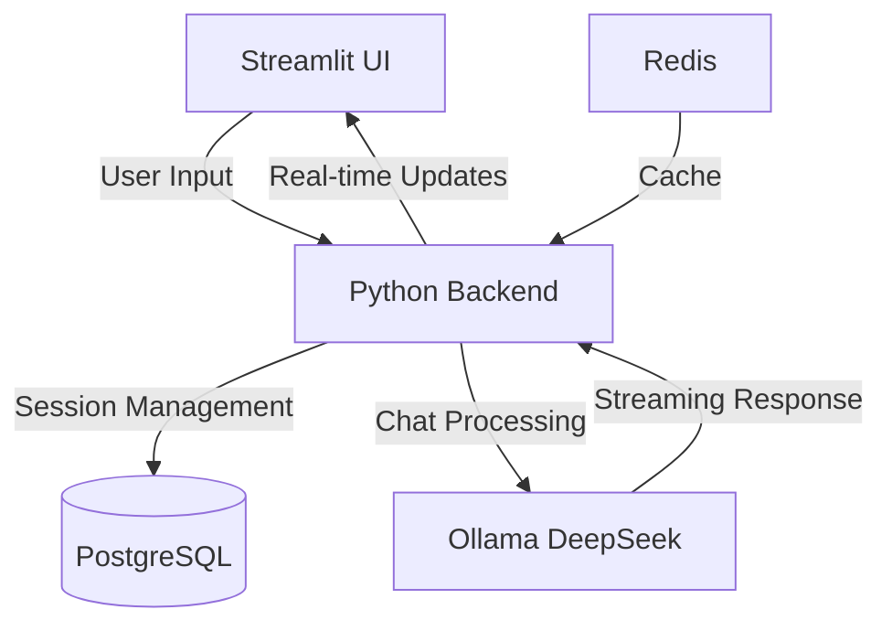
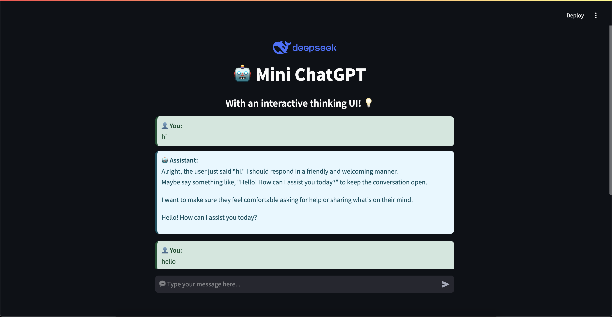

# Chat DeepSeek UI

# repo
https://github.com/pleabargain/chat-deepseek-ui-1


## getting this going
It took a while to get this going. The original repo was not working for me. I spent quite a bit of time trying to get it working.

A simple web-based chat interface powered by Ollama's DeepSeek model. This tool provides an interactive, real-time chatting experience with the assistant, using Streamlit for the frontend. The assistant processes and streams responses back to the user, ensuring a seamless and engaging interaction.

## System Architecture



## Features
- 🚀 **Real-time Chat Interface**: Dynamic interaction with the assistant
- 💾 **Persistent Chat History**: Maintains conversations between sessions
- 🔄 **Automatic History Management**: Saves chat history to database
- 🎨 **Clean Streamlit UI**: Modern and intuitive interface
- 🐳 **Docker Integration**: Easy deployment with containers
- 📝 **Comprehensive Logging**: Detailed error tracking and monitoring



## Prerequisites

1. Install [Ollama](https://ollama.com/download)
2. Pull the DeepSeek model:
```sh
ollama pull deepseek-r1
```

## Setup

### 1. Clone Repository
```sh
git clone https://github.com/ductnn/chat-deepseek-ui.git
cd chat-deepseek-ui
```

### 2. Database Setup
```sh
# Make sure Docker Desktop is running
docker-compose up -d
```

### 3. Install Dependencies
```sh
pip install streamlit ollama

# If pyarrow build fails, install binary:
pip install --only-binary=:all: pyarrow
```

### 4. Configure Environment
Create `.env` file (or copy from `.env.example`):
```sh
DB_NAME=chat_db
DB_USER=postgres
DB_PASSWORD=postgres
DB_HOST=localhost
DB_PORT=5432
```

### 5. Run Application
```sh
streamlit run app.py
```

## Logging System

The application implements comprehensive logging for operations and troubleshooting:

### Log Structure
- Daily rotating log files in `logs/` directory
- Format: `error_YYYY-MM-DD.log`
- UTF-8 encoding for international character support

### Log Entry Format
```
[YYYY-MM-DDTHH:mm:ss.sssZ] [LEVEL] Message
File path and line number
Stack trace (if applicable)
---
```

### Logging Features
- 📁 Automatic directory creation
- 🔄 Daily log rotation
- 📊 Console and file output
- 🔍 Detailed error tracking
- 🌐 UTF-8 character support

### View Current Logs
```sh
cat logs/error_$(date +%Y-%m-%d).log
```

## Troubleshooting

### Database Issues

1. **Verify Containers**
```sh
# Check running containers
docker ps

# Restart if needed
docker-compose down
docker-compose up -d
```

2. **Database Credentials**
- Match `.env` with `docker-compose.yml`
- Default credentials:
  ```
  DB_USER=postgres
  DB_PASSWORD=postgres
  DB_NAME=chat_db
  ```

3. **Common Errors**
- "no password supplied": Check `.env` credentials
- "password authentication failed": Verify against `docker-compose.yml`
- "connection refused": Check Docker container status

### Application Issues

1. **UI Problems**
- Verify Streamlit server status
- Check package installations
- Review error logs

2. **Chat History Issues**
- Confirm database connection
- Check table initialization
- Verify permissions

3. **Session Problems**
- Clear browser cache
- Restart Streamlit server
- Check database connectivity

## Project Structure
```
chat-deepseek-ui/
├── app.py              # Main Streamlit application
├── chat_model.py       # Ollama integration
├── config.py          # Configuration management
├── input_handle.py    # Input processing
├── sessions.py        # Session management
├── ui.py             # UI components
├── utils.py          # Utility functions
├── assets/           # Static assets
├── logs/             # Application logs
└── postgres/         # Database initialization
```

## Contributing
1. Fork the repository
2. Create a feature branch
3. Commit your changes
4. Push to the branch
5. Create a Pull Request

For additional help or bug reports, please open an issue on the GitHub repository.
